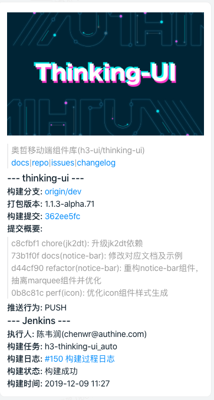
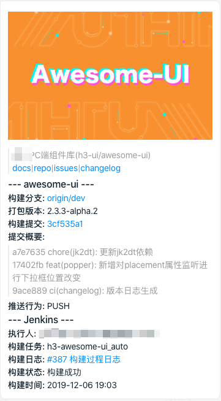
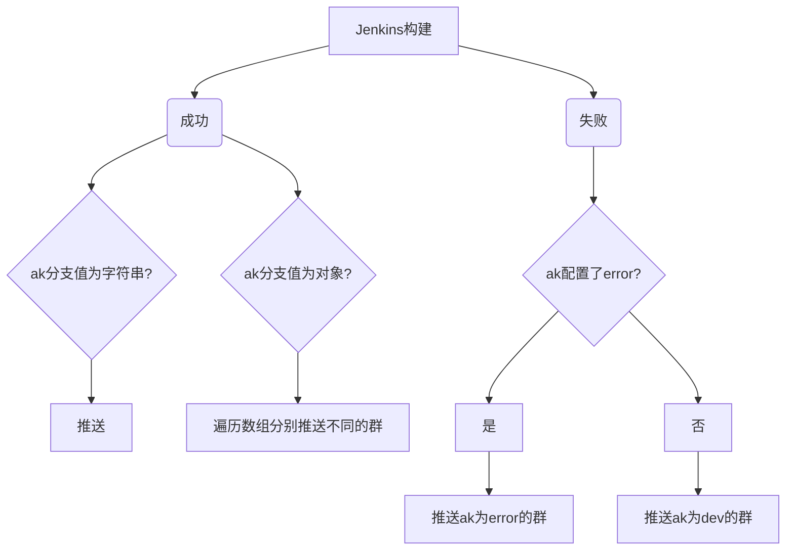

#### 结合 Gitlab 和钉钉的自定义机器人(webhook 触发)的一个推送封装


## 效果图

- **打包的版本号仅在 master 和 dev 才有可能出现，对应 npm 的 dist-tags 的 latest 和 dev**

- **banner 不传是没有顶部的图片的,也支持文本的传入或者标准的 markdown 字符串**

### 稳定版



### 开发版



## 安装

```bash
npm i -D jk2dt
```

## 使用

### 配置文件

1. 在根目录提供`jk2dtrc.js`,格式为

```javascript
module.exports = {
  git: {
    RepoTitle: "测试标题"
  }
};
```

2. 在`package.json`内添加执行的 scripts

```json
{
  "scripts": {
    "jk2dt": "jk2dt"
  }
}
```

### package.json

提供`jk2dt`键值对

```json
{
  "scripts": {
    "jk2dt": "jk2dt"
  },
  "jk2dt": { "git": { "RepoTitle": "呵呵哒" } }
}
```

**两者都提供的情况下优先读取配置文件的**


### 模块引用

```javascript
const jk2dt = require('@h3/jenkins-2-dingtalk);

// 若是只有一个群，只要传入符合dingtalk 的 postdata 数据即可
// 若是有多个，对象可以加到数组里面，传入数组
jk2dt(params);
```


## 可配置的

可以更改部分 git 的信息，亦或者推送的格式，更多的定制可以查看源码传入。

很多是关联性配置，所以只要传入最小化的核心参数即可。

```javascript
config:{
  git:{}, // git的一些配置
  banner:'', // 消息卡片的 banner
  push:{} // 钉钉的推送 data，这个可以覆盖整个推送的钉钉数据，包括 ak,at ，乃至不要卡片化
  ak:{}, // 钉群的 accessToken
  at:{}, // 全局钉钉@谁或者全体
}
// 权重 push-> at、ak
```

### Git

| 参数                | 说明                                           | 类型          | 默认值 |
| ------------------- | ---------------------------------------------- | ------------- | ------ |
| RepoDoc             | 文档的链接                                     | string?(可选) | ''     |
| RepoDomain          | gitlab 的域名,不传则默认从jenkins 环境变量拿整个仓库的 url | string        | ''     |
| RepoGroup           | 参数所属 Gitlab 的群组                         | string        | ''     |
| RepoTitle           | 仓库的中文名,不传则拿仓库名字                  | string        | ''     |
| RepoCommitCountShow | 显示最近几次 commit                            | Number        | 5      |
| RepoIssues          | issue 的链接，没有则内部构建拼接              | string        | ''     |
| RepoChangelog       | changelog 的链接，没有则内部构建拼接          | string        | ''     |
| JOB_DOMAIN       | Jenkins Job 的链接           | string        | ''  |

其他分支这些的信息是从 jenkins 上拿取的，没有特殊情况不需要去调整

### Banner

支持 markdown 的传入,用字符串包裹,亦或者纯文本

```bash
\n
```


### AccessToken(ak)

这个本来是属于钉钉推送的里面的，抽离出来可单独配置,对应上面的`ak`参数，`ak`可以结合分支。

- 成功的情况下 master 丢大群，其他对应分支群（无对应 token 则走 dev ）
- 失败的情况下，优先找是否有配置 error 的 ak，没有走 dev



| 值   | 介绍                | 类型          | 默认值 |
| ---- | ------------------- | ------------- | ------ |
| 分支 | 就是 git 的分支名字 | String/Object | ''     | v |

#### 常规字符串键值对

```javsacript
{
  master: 'xxxx', // 稳定版成功发布推送的群(必须)
  dev: 'xxxx', // 不管成功失败都丢的群(必须)
  next:'xxx', // 若是有超前版本也可以单独推送到内测群组,不设置则默认走 dev
  test:'xxx', // 若是配置可以推送给测试群，不设置则默认走 dev
  error:'xxx', // 失败优先推送的群组，没有走 dev
};
```

**匹配不到的分支优先寻找 error 的 ak，没有默认走 dev 的 ak**

#### 数组对象格式

**此处做了强校验，对象传入必须两个数组存在且不为空，否则忽略该东东**

**键值对字符串依旧遵循上面的规则**

```javsacript
{
  master:{
    success:[], // 成功推向的哪些群
    error:[], // 失败推向的哪几个群
  },
};
```

### at(通知)

这也是属于钉钉构建数据的一部分，这里单独抽离也是支持某些分支是否要@全体，或者某人

#### 格式

```js
ak: {
  master: {
    "atMobiles": [
        "156xxxx8827",
        "189xxxx8325"
    ],
    "isAtAll": false
  }
}
```

**若是不传则走默认逻辑,只有 master 构建成功的时侯才去@全体**

#### 钉钉的推送格式

详情请看：[钉钉自定义机器人文档](https://ding-doc.dingtalk.com/doc#/serverapi2/qf2nxq)。

此处封装用的是 markdown 风格,推送的 json 如下

```bash
{
  accessToken: 'xxxx5',
  postData: {
    msgtype: 'markdown',
    markdown: {
      title: '构建 undefined(undefined 构建过程日志)',
      text: '\n' +
        '\n' +
        '\n' +
        '  > PC端UI组件库(h3-ui/undefined)\n' +
        '  >\n' +
        '  > [docs](http://h3uxxyun.com/pcdoc/) |  [repo](http://gitxxn.com/h3-ui/undefined) | [issues](http://gitlxxn.com/h3-ui/undefined/issues) | [changelog](http://gitlaxx.com/h3-ui/undefined/blob/master/CHANGELOG.md)\n' +
        '\n' +
        '### --- undefined ---\n' +
        '\n' +
        '\n' +
        '**构建分支:** [origin/undefined](http://gitlxx.com/h3-ui/undefined/commits/undefined)\n' +
        '\n' +
        '### --- Jenkins ---\n' +
        '\n' +
        '**代码推送:** undefined(undefined)\n' +
        '\n' +
        '**构建任务:** undefined\n' +
        '\n' +
        '**构建日志:** [undefined 构建过程日志](https://xxxxx/jenkins/job/undefined/undefined/console)\n' +
        '\n' +
        '**构建状态:构建失败**\n' +
        '\n' +
        '**构建时间:2019-12-16 17:04**\n'
    },
    at: { isAtAll: false }
  }
}
```
